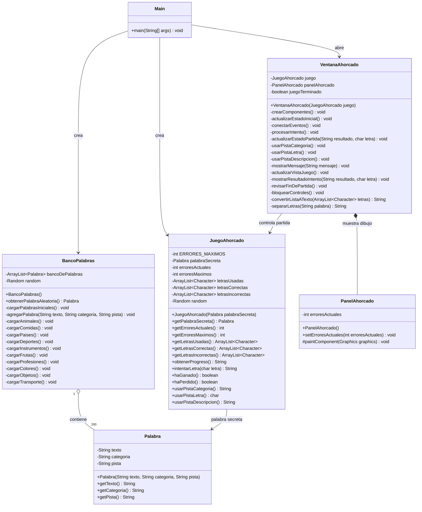

# Diagrama de clases

Este diagrama representa la estructura principal del Juego del Ahorcado Interactivo con Java Swing.
Incluye las clases del modelo, la logica, la interfaz y el punto de inicio, omitiendo componentes internos de Swing para mantenerlo legible en una sustentacion academica.

